# Adaptive AI-Powered Security Gateway for Hybrid Cloud

An intelligent, multi-layer security gateway and telemetry analysis console engineered for hybrid cloud infrastructure (on-premise networks, PCAP captures, and AWS VPC Flow Logs).

The platform integrates statistical machine learning threat classification, exact Shapley (SHAP) feature attributions, a deterministic policy engine with safe graduated containment modes (`DRY_RUN` and `SANDBOX`), and an optional advisory AI Security Analyst Copilot.

---

## 🏛️ System Architecture

The gateway enforces an **authoritative deterministic security boundary** where automated policy decisions and firewall actions are driven strictly by verified ML predictions and deterministic rule logic. The optional LLM Copilot operates on an **isolated, advisory-only branch** with zero authority over policy enforcement.

```mermaid
flowchart TD
    subgraph Ingestion ["1. Telemetry Ingestion Layer"]
        A1[Network Packet Capture / PCAP] --> B[Flow Aggregator & Parser]
        A2[AWS VPC Flow Logs / CloudWatch] --> B
        A3[Synthetic & Benchmark Telemetry] --> B
    end

    subgraph ML_Pipeline ["2. Threat Detection & Explainability Layer"]
        B --> C[Feature Extractor - 10 Features]
        C --> D[StandardScaler Normalization]
        D --> E[RandomForest Classifier - 5 Classes]
        E --> F[Continuous Risk Scorer: 0 - 100]
        E --> G[SHAP TreeExplainer Attributions]
    end

    subgraph Decision_Engine ["3. Authoritative Security Boundary"]
        F --> H{Deterministic Policy Engine}
        G --> H
        H -->|Allowlist Check| I[Management Protection Bypass]
        H -->|Risk >= 85 / Critical| J[Immediate Containment]
        H -->|Risk 70-84 / High| K[Timed Isolation / Sandbox TTL]
        H -->|Risk 40-69 / Medium| L[Traffic Throttling / Rate-Limit]
        H -->|Risk < 40 / Low| M[Allow & Monitor]
    end

    subgraph Enforcement ["4. Enforcement & Persistence Layer"]
        J & K & L --> N[Enforcement Adapter]
        N -->|DRY_RUN| O[Simulated Audit Logging]
        N -->|SANDBOX| P[In-Memory Quarantine + TTL]
        H --> Q[(PostgreSQL Database)]
        Q --> R[Security Events & Notifications]
        Q --> S[Policy Audit Ledger]
        Q --> T[Active Containment Rules]
    end

    subgraph Console ["5. Presentation & Security Operations Console"]
        Q --> U[FastAPI REST API v1]
        U --> V[React 18 + TypeScript Console]
    end

    subgraph Advisory_AI ["6. Advisory AI Analyst (Isolated Branch)"]
        R -.-> W[AI Analyst Copilot Engine]
        W -.->|Local Deterministic / Groq / OpenAI| X[Natural Language Briefings]
        X -.-> V
    end

    style Advisory_AI fill:#1e293b,stroke:#64748b,stroke-dasharray: 5 5
    style Decision_Engine fill:#0f172a,stroke:#3b82f6,stroke-width:2px
    style ML_Pipeline fill:#0f172a,stroke:#10b981,stroke-width:2px
```



---

## ⚡ Key Capabilities & Implementation Status

| Component | Capability | Implementation Status | Scope / Behavior |
| :--- | :--- | :---: | :--- |
| **Flow Telemetry Ingestion** | Multi-source flow aggregation | **Implemented** | Aggregates IP flow records from PCAP files, raw network sockets, and AWS VPC Flow Logs. |
| **Feature Extraction** | 10-feature statistical representation | **Implemented** | Extracts observed features (`packet_count`, `byte_count`, `duration`, `dst_port`, `failed_auth_count`) and derived rates (`conn_rate`, `unique_dst_ports`, `bytes_per_sec`, `packets_per_sec`, `avg_packet_size`). |
| **Threat Classification** | Multi-class Random Forest | **Implemented** | 5-class detection: `BENIGN`, `PORT_SCAN`, `BRUTE_FORCE`, `TRAFFIC_SPIKE`, `SUSPICIOUS_TRANSFER`. |
| **Model Explainability** | Exact Shapley attributions | **Implemented** | Generates non-causal feature contribution z-scores and Shapley values via `shap.TreeExplainer`. |
| **Deterministic Policy Engine** | Graduated security actions | **Implemented** | Context-aware decision engine mapping risk score to `BLOCK`, `QUARANTINE`, `THROTTLE`, `MONITOR`, or `ALLOW`. |
| **Safe Enforcement Modes** | Guarded containment | **Implemented** | `DRY_RUN` (zero host impact audit mode) and `SANDBOX` (in-memory quarantine with automatic TTL expiration and instant revocation). |
| **Management Protection** | Allowlist bypass | **Implemented** | Critical management subnets (`10.0.0.0/8`, `172.16.0.0/12`, `192.168.0.0/16`, `127.0.0.1`) cannot be automatically blocked. |
| **Relational Persistence** | PostgreSQL audit store | **Implemented** | Stores security events, notifications, active enforcements, and immutable policy audit logs. |
| **AI Analyst Copilot** | Executive security briefing | **Implemented (Advisory)** | Synthesizes threat narratives using local deterministic templates, Groq Cloud (`llama-3.3-70b-versatile`), or OpenAI (`gpt-4o-mini`). Zero enforcement authority. |
| **AWS Integration** | CloudWatch & VPC Flow Logs | **Read-Only / Fixtures** | Read-only parser and offline high-fidelity deterministic test fixtures (`AWS_VPC_FLOW_LOG_FIXTURE`). Zero active AWS API write permissions. |

---

## 🔬 Machine Learning Credibility & Performance

The gateway strictly distinguishes between **internal holdout benchmark metrics** and **external public dataset generalization metrics**.

### Internal Holdout Test Set (Phase 11B Calibrated Benchmark)
* **Dataset:** 10,000 synthetic network flow records modeled on continuous log-normal durations, variable packet distributions, authentication retry noise, and multi-port CDN browsing variance.
* **Partition:** 70% Train (7,000), 15% Validation (1,500), 15% Holdout Test (1,500).
* **Leakage Prevention:** `StandardScaler` fitted strictly on the Train partition.

| Metric | Production Random Forest (Holdout Test) |
| :--- | :---: |
| **Overall Accuracy** | **99.80%** |
| **Macro Precision** | **0.9982** |
| **Macro Recall** | **0.9971** |
| **Macro F1-Score** | **0.9977** |
| **Weighted F1-Score** | **0.9980** |
| **False Positive Rate (FPR)** | **0.33%** |
| **False Negative Rate (FNR)** | **0.11%** |

### External Dataset Validation (Phase 11C — CIC-IDS2017 Benchmark)
To assess true generalization, the frozen production model was evaluated against 4,888 mapped flow records from the public **CIC-IDS2017** benchmark without refitting or data leakage:

* **External Accuracy:** **60.78%** | **Macro F1:** **0.2972** | **FPR:** **4.97%** | **FNR:** **8.45%**
* **Root Cause of Distribution Shift:** High precision on structural attacks (`BRUTE_FORCE` at 100.0%, `PORT_SCAN` at 87.5%), with lower recall on volumetric attacks (`TRAFFIC_SPIKE`) due to different packet rate scaling factors in testbed subnet traffic.
* **Experimental External-Trained Model (Path B):** An experimental Random Forest trained directly on the CIC-IDS2017 schema achieved **82.23% accuracy** and **0.5767 Macro F1**.

> For complete evaluation methodology, confusion matrices, and limitations, see [`ml/MODEL_CARD.md`](file:///c:/Users/LENOVO/Desktop/hybrid-gateway-security/ml/MODEL_CARD.md).

---

## 🔒 Authoritative Security Boundary & LLM Isolation

```text
[ AUTHORITATIVE PATH - DETERMINISTIC ]
Packet / Flow -> Feature Extraction -> StandardScaler -> RandomForest -> Risk Score (0-100) -> SHAP -> PolicyEngine -> Enforcement

[ ADVISORY PATH - NON-AUTHORITATIVE ]
Persisted Event -> Prompt Construction -> LLM Copilot (Local / Groq / OpenAI) -> Markdown Narrative Display in Console
```

1. **Zero Enforcement Authority:** The LLM cannot create, modify, revoke, or execute firewall rules or policy configurations.
2. **Deterministic Precedence:** Hard policy rules, allowlists, and deterministic thresholds always supersede probabilistic models or analyst notes.
3. **Prompt Injection Resistance:** Raw telemetry strings are sanitized and strictly delimited within structural prompt blocks before being passed to LLM providers.
4. **Resilient Fail-Safe:** If an external LLM provider fails, times out, or lacks credentials, the system silently falls back to local deterministic rule synthesis without degrading gateway operations.

---

## ☁️ Hybrid Cloud & AWS Telemetry Scope

To avoid misrepresenting capabilities during evaluation:

* **Implemented (Read-Only):** Ingestion and aggregation parser for standard AWS VPC Flow Log format (version 2). Correctly extracts IP endpoints, ports, packet/byte counts, and duration.
* **Simulated / Offline Fixtures:** Deterministic test fixtures (`aws_port_scan_recon_fixture.log`, `aws_traffic_spike_fixture.log`, `aws_benign_transit_fixture.log`) allow comprehensive testing without active AWS credentials.
* **Not Implemented:** Automated modification of AWS Security Groups, Network ACLs, or Route Tables. The gateway is a monitoring and prototype containment engine.

---

## 🛠️ Project Structure

```
hybrid-gateway-security/
├── backend/                         # FastAPI Application Backend
│   ├── app/
│   │   ├── api/v1/                  # REST API Endpoints (events, telemetry, policy, analytics)
│   │   ├── core/                    # Application configuration & database session
│   │   ├── models/                  # SQLAlchemy Relational Models
│   │   ├── schemas/                 # Pydantic Request/Response Validation
│   │   └── services/                # Business Logic (PolicyEngine, MLService, SHAP, Ingestion)
│   └── tests/                       # Backend pytest suite (API, Policy, Ingestion, Persistence)
├── ml/                              # Machine Learning Pipeline & Artifacts
│   ├── data/                        # Calibrated flow generator (generator.py)
│   ├── evaluation/                  # Benchmark scripts & external dataset mapping (evaluate_external.py)
│   ├── features/                    # 10-feature schema extractor & validation
│   ├── models/                      # Production model artifacts (model.joblib, scaler.joblib, metadata.json)
│   ├── tests/                       # ML unit, robustness, and leakage tests
│   └── MODEL_CARD.md                # Comprehensive model card & evaluation disclosure
├── src/                             # React 18 + TypeScript Frontend Console
│   ├── components/                  # UI Views (Dashboard, Events, Policies, Analytics, Evaluation)
│   ├── services/                    # API client services
│   ├── App.css                      # Premium dark-mode security operations design system
│   └── types.ts                     # TypeScript data interfaces
├── docs/                            # Documentation & Demonstration Walkthroughs
│   └── REVIEW_GUIDE.md              # 5-10 minute reviewer demonstration guide
├── docker-compose.yml               # PostgreSQL 16 Alpine container configuration
├── .env.example                     # Environment configuration template
└── pytest.ini                       # Pytest configuration
```

---

## 🔐 Multi-User Authentication & Identity System

The gateway enforces a Zero-Trust identity perimeter around the Security Operations Console:
* **Opening Screen Guard**: Intercepts unauthenticated requests and presents a cyberpunk-themed authentication interface (`AuthView`).
* **Local Credentials**: Secure user registration, password complexity checks, and salted bcrypt password hashing.
* **JWT Session Rotation**: Short-lived access tokens (30 min) + cryptographically unique, rotated refresh tokens (7 days) persisted in PostgreSQL.
* **Initial Admin Bootstrap**: Safe environment bootstrap (`ADMIN_EMAIL=admin@gateway.local`, `ADMIN_PASSWORD=AdminSecOps2026!`) with `ADMIN` role persistence.
* **Google OAuth 2.0 / OpenID Connect**: Seamless single sign-on with server-side identity verification and safe account linking.
* **Role-Based Authorization**: Distinct access levels for `ADMIN` (rules/containment/users), `ANALYST` (telemetry/investigations), and `USER` (read-only observer).
* **Detailed Documentation**: See [docs/authentication_system.md](docs/authentication_system.md).

---

## 🚀 Local Installation & Reproduction Guide

### Prerequisites
* **Python:** $\ge$ 3.10 (tested on Python 3.12)
* **Node.js:** $\ge$ 18.x and `npm`
* **Docker:** (Optional, for running local PostgreSQL datastore)

### Step 1: Clone Repository
```powershell
git clone https://github.com/madhumitag06/hybrid-gateway-security.git
cd hybrid-gateway-security
```

### Step 2: Set Up Python Virtual Environment
```powershell
python -m venv ml/.venv
.\ml\.venv\Scripts\Activate.ps1
python -m pip install --upgrade pip
pip install -r ml/requirements.txt
```

### Step 3: Install Frontend Dependencies
```powershell
npm install
```

### Step 4: Configure Environment Variables
```powershell
cp .env.example .env
```
*(Default settings bootstrap the admin user `admin@gateway.local` with password `AdminSecOps2026!`)*.

### Step 5: Start PostgreSQL Datastore (Optional Docker Container)
```powershell
docker compose up -d
```

### Step 6: Run Automated Tests
```powershell
# Run the complete 133-test backend, ML, explainability, and auth test suite:
.\ml\.venv\Scripts\pytest.exe -q

# Run the frontend production build verification:
npm run build
```

---

## 🧪 Reproducing ML Training & Evaluation

All ML training and evaluation workflows are fully deterministic:

```powershell
# 1. Train the Production Random Forest Model (saves to ml/models/):
python -m ml.models.train

# 2. Run External Dataset Generalization Benchmark (Path A - CIC-IDS2017):
python -m ml.evaluation.evaluate_external

# 3. Train Experimental External Model (Path B):
python -m ml.evaluation.train_external_model

# 4. Run ML Robustness, Leakage, and Boundary Tests:
.\ml\.venv\Scripts\pytest.exe ml/tests/ -v
```

---

## ⚠️ Known Limitations

1. **Layer 4 Flow Telemetry:** The model classifies threats using packet counts, byte volumes, connection rates, and port patterns. It does not perform Deep Packet Inspection (DPI) on encrypted application payloads.
2. **Authentication Signal in Generic NetFlow:** `failed_auth_count` is unavailable in standard L4 NetFlow headers and is set to 0 unless correlated with host authentication logs.
3. **Distribution Shift:** Model accuracy degrades when evaluated on external network topologies with different baseline volumetric characteristics (e.g. university testbeds vs enterprise clouds).
4. **Prototype Nature:** Host enforcement operates in guarded `DRY_RUN` and in-memory `SANDBOX` modes designed for evaluation and demonstration.
